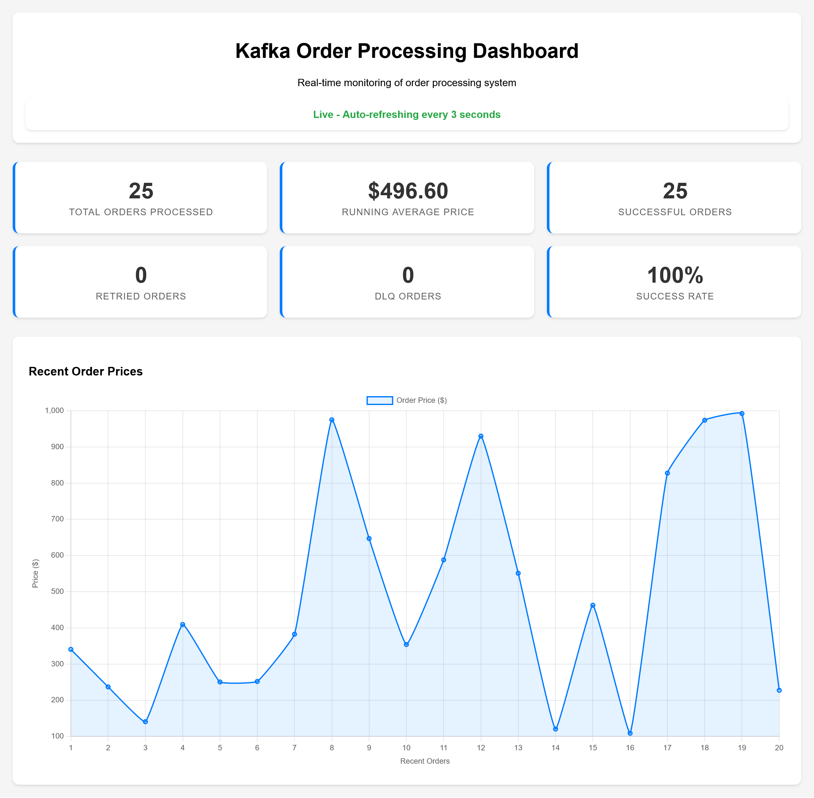

# Kafka Order Processing System

A Kafka-based system for producing and consuming order messages with Avro serialization, real-time price aggregation, retry logic, and a Dead Letter Queue (DLQ). The system includes a web dashboard for monitoring order metrics.

---

## Features

- Avro serialization for order messages  
- Real-time price aggregation (running average)  
- Retry logic for temporary failures  
- Dead Letter Queue (DLQ) for permanent failures  
- Dockerized for easy setup  
- Kafka UI for monitoring  
- Web dashboard for real-time metrics (success rate, DLQ count, running average price, recent prices)

---

## Quick Start

### 1. Clone the repository
```bash
git clone https://github.com/chanmini-kavinya/kafka-order-processing-system
cd kafka-order-processing-system
```

### 2. Start the system
```bash
docker-compose up -d
```

This will start the following services:
- `zookeeper`
- `kafka`
- `schema-registry`
- `order-producer`
- `order-consumer`
- `order-dashboard`
- `kafka-ui`

---

### 3. Access UI

- **Kafka UI**: [http://localhost:8080](http://localhost:8080)  
  View and monitor Kafka cluster in real-time.

- **Dashboard**: [http://localhost:5000](http://localhost:5000)  
  Displays metrics such as:
  - Total orders processed  
  - Success count  
  - DLQ count  
  - Success rate  
  - Running average price  
  - Recent order prices  



---

### 4. Resetting the Environment

If you encounter **unhealthy container issues**, run the following commands to reset everything:

```bash
docker-compose down -v --remove-orphans
docker-compose up -d
```

---

### 5. Stop the System
```bash
docker-compose down
```
